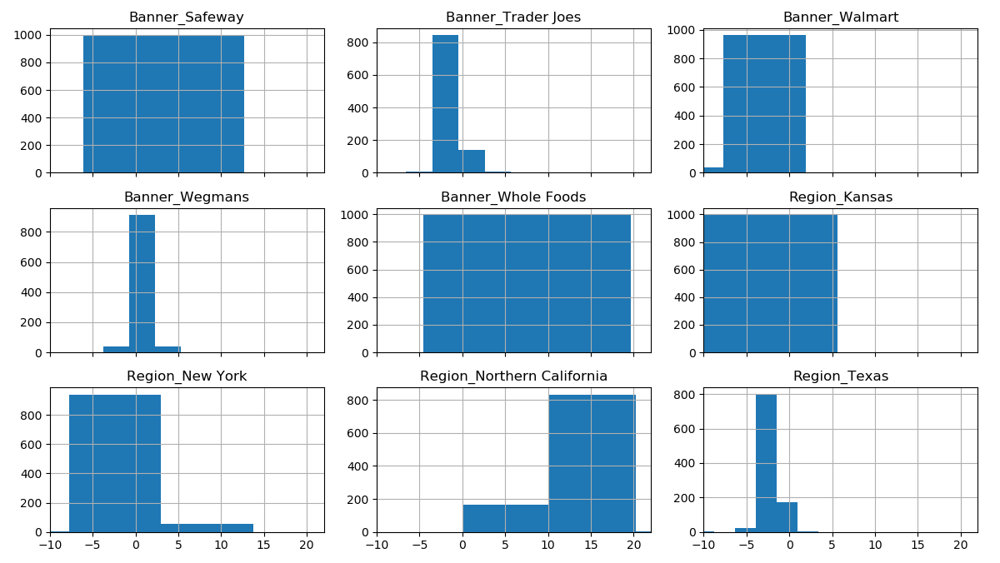

Competitive Retail Intelligence
==========================

This project aims at analyzing data from different retailers. These data are collected by sending auditors into physical stores to record pricing and assortment information. 

This data is then aggregated and validated using different models and outlier identification techniques, e.g. by assuming that a store
price is equal to a base price for the product/UPC multiplied by a store-specific scaling factor and a region-specific scaling factor.

This can be represented as
Pijk = Pi Aj Bk for observed price P for product i in store j and region k. A and B are multiplicative factors of the order of the unity.
 
Collected prices are provided in a “prices.csv” file, which describes prices collected for products, represented as UPC, at a specific
physical store locations, represented as Store ID. It is also included a json file for the 'Banner' and 'Region' fields corresponding to a certain 'Store ID'.

The code is written in python. There is 1 routine:
* analysis.py: it performs the full modelling. __It is intended to be used e.g. in an IPython session, not as a script__.
 
Here we report the version of the libraries used:
* Python 3.6.4
* numpy 1.14.0
* matplotlib 2.1.2
* pandas 0.22.0

# First task
For the purpose of this task we need to apply some aggregation of the data. 

First, we fetch the keys "Banner" and "Region" corresponding to the "Store ID" from the json file attached. We used _pandas_ for this goal. 

Next, we create a pivot table. It aggregates a table of data by one or more keys, arranging the data in a rectangle with some of the group keys along the rows and some along the columns. We used _Banner_ and _UPC_ for rows, _Region_ in columns and price as printed value. Data are saved into a csv file ("output.csv").

# Second task
Here we need to call out anything we believe noteworthy. 

First, we looked for Nan values for the Banner ID, due to the fact that the corresponding 'Store ID's are not present in the json file attached. We identified two 'Store ID's, namely 60957 and 38472, with 804 Nan values, which we hereafter dropped. The corresponding auditor was Jack Smith.

We observe that data are collected over a period of 2 weeks, between 2017-10-16 and 2017-10-29. We have a total of 1000 unique items.

Next, we fitted a linear model on the prices. We start by creating dummy variables for the fields _Banner_ and _Region_ (the so-called OneHot encoding). 

For the modelling, we point out that the aforementioned eqn Pijk becomes linear in log space. A linear model is thus fitted on the log of the prices vs. log of Aj and Bk.

We thus applied a group-wise linear regression, that is an ordinary least squares (OLS) regression on each chunk of data with the same _UPC_. For each item, __the slopes of the linear fit can be interpreted as the fractional variation of the price with respect to the median value__. These slopes are then averaged out to infer interesting relation between the prices and the _Banner_ and _Region_ fields.

Here we note that the prices from Whole Foods seem to be among the smallest ones, which is unexpected. We further inspect the data, for example the item with UPC 514912132, and note that there are outlier prices. Therefore, we decided to clean data based on the criterion that the prices must be within 3&sigma; from the average (here &sigma; is the mean absolute deviation, which is an outlier resistant estimator of the standard deviation) for each UPC group. 

After cleaning the data, the fitting results are consistent with the naive expectation that Whole Foods is statistically more expensive than other stores. In this respect, we performed a two-sided T-test  for the null hypothesis that 2 independent samples, namely Whole Foods and Safeway, have identical average (expected) values. We do not assume that the populations have identical variances, and we obtain that the null hypothesis is rejected with p-value ~10-34.  

Fitting results (i.e. the percentage variation of the price with respect to the median value) are presented below (sorted in ascending order), along with their pdf distribution. Note that we present the values of the group-wise fitting parameters averaged out across all the items.

| Feature      | % variation|
| ------------- |:-------------:|  
| Banner_Walmart     |           -6.2 | 
|Region_Kansas               |  -3.5  |
|Region_Texas                  |-2.3  |
|Banner_Trader Joes           | -1.2  |
|Region_New York             |   0.7  |
|Banner_Wegmans              |   0.7  |
|Banner_Safeway             |    3.8  |
|Banner_Whole Foods            | 8.3  |
|Region_Northern California   | 10.6|

We also inferred - as reference - the fitting parameters that we would obtain by assuming that all the UPCs share the same slopes, rather than performing a group-wise linear regression. Results are roughly consistent between the two methods, with same differences due the fact that the distributions (see below Fig.) are skewed and the two methods hinge on slightly different assumptions.

In the above Fig. we present the pdf distribution of the group-wise fitting parameters. Looking at the figure, we can also see that the total number of sampled prices (the area of the histograms) can vary a lot across different Regions and Banners.

# On the outlier prices
The aforementioned mode allows us to identify a total of 935 outlier prices. While the exact number might be model/parameter dependent, it is interesting to point out that 896 out of 935 can be ascribed to the auditor Dave Johnson, 35 to Bob Smith and 4 to Jack Smith.  Jill and Bob Smith are the only responsible for the 804 Nan values for the Banner ID (these corresponding 'Store ID's are not present in the json file).

Also, there are only two surnames among the auditors: it looks like a family business.

